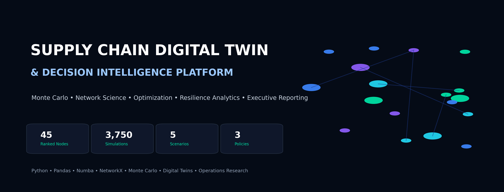

# Supply Chain Digital Twin & Decision Intelligence Platform

Industrial analytics platform integrating Monte Carlo simulation, Digital Twin modeling, network science, intervention optimization, resilience analytics, executive decision support, and AI-augmented analytical workflow orchestration.

## Research Ecosystem

```text
Near-Critical Systems (Paper A)
        ↓
Controlled Near-Critical Benchmark (Paper B)
        ↓
Supply Chain Digital Twin Application
```

This repository represents the industrial application layer of the research program.

### Research lineage

**Near-Critical Systems (Paper A)** introduced the foundational theory: near-critical operating regimes, stability margins, threshold-control logic, diffusion approximation, collapse-risk dynamics and first-passage behavior.

**Controlled Near-Critical Benchmark (Paper B)** provided the reproducible experimental bridge. It contains the benchmark scripts, figures, results and manuscript materials used to evaluate preventive threshold-control policies in a controlled environment.

**Supply Chain Digital Twin** transfers those ideas into a networked industrial setting. The project extends the near-critical framework with:

- multi-echelon supply-chain modeling
- network-aware resilience analytics
- intervention optimization
- critical-node identification
- executive decision support
- industrial Digital Twin experimentation
- AI-assisted scenario design, KPI structuring and analytical iteration

### Related repositories

- https://github.com/net421/near-critical-systems
- https://github.com/net421/controlled-near-critical

---

## Executive Summary

Modern supply chains operate under uncertainty: demand shocks, lead-time variability, supplier failures, capacity limits and cascading operational risk.

This project builds a modular Supply Chain Digital Twin that simulates multi-echelon supply-chain behavior, evaluates policies under uncertainty and recommends resilience interventions using simulation-driven decision intelligence.

The platform answers questions such as:

- Which nodes create the greatest operational risk?
- Which policy performs best under disruption scenarios?
- Where should resilience investment be allocated?
- How does service level change under demand, lead-time or failure shocks?
- Which nodes combine fragility, economic severity and network importance?

## AI-Augmented Analytics Workflow

This project is also a demonstration of **AI-native analytics engineering** applied to industrial supply-chain decision support.

Instead of treating BI and analytics as a manual, tool-by-tool process, the workflow uses AI as a technical execution layer to accelerate the conversion of a business problem into simulation logic, KPI definitions, scenario design, analytical outputs, documentation and executive-ready reporting.

The operating method is:

1. Define the supply-chain decision problem and business context.
2. Structure the KPIs, resilience metrics, intervention logic and scenario questions.
3. Use AI-assisted iteration to generate and refine Python logic, analytical structures, visual explanations and documentation.
4. Validate results through simulation outputs, consistency checks, domain reasoning and reproducible artifacts.
5. Convert the final workflow into a tool-agnostic analytical system that can support dashboards, reports, notebooks, executive summaries or future BI implementations.

This AI-augmented method allows the project to industrialize work that would traditionally require slow manual construction of KPI models, dashboards and scenario analyses, while preserving human control over logic, assumptions and decision relevance.

## Core Contribution

The most important research contribution of this repository is the transfer of near-critical threshold-control logic from a controlled benchmark environment into a realistic networked supply-chain Digital Twin.

The practical analytics contribution is the transformation of supply-chain resilience questions into a reproducible, AI-augmented, simulation-driven decision platform.

The project therefore serves as the industrial application layer of the broader near-critical research program.

## Technical Scope

- Monte Carlo simulation
- Digital Twin modeling
- Supply-chain analytics
- Network science
- Resilience analytics
- Intervention optimization
- Decision intelligence
- Executive reporting
- AI-assisted KPI and scenario design
- Tool-agnostic analytics workflow development

## Repository Status

Active industrial and research repository connected to the Near-Critical Systems and Controlled Near-Critical Benchmark research line.