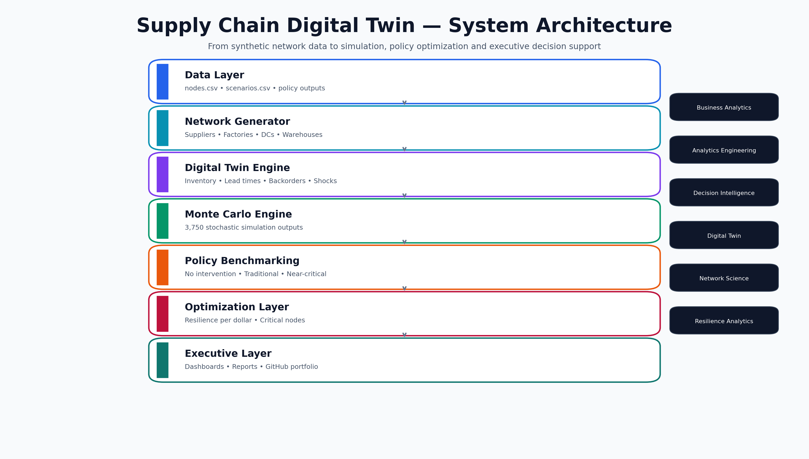
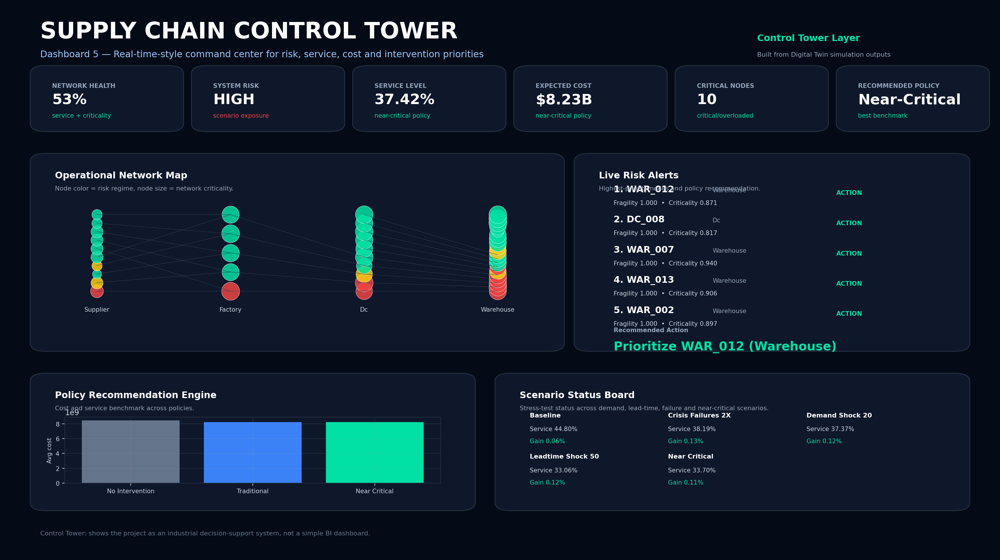
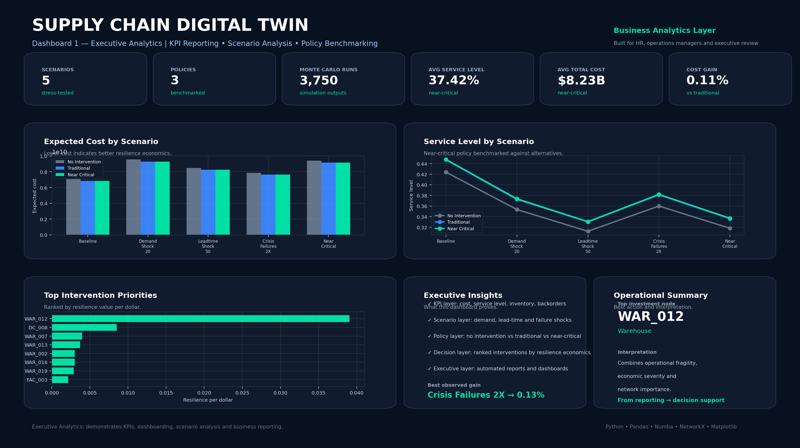
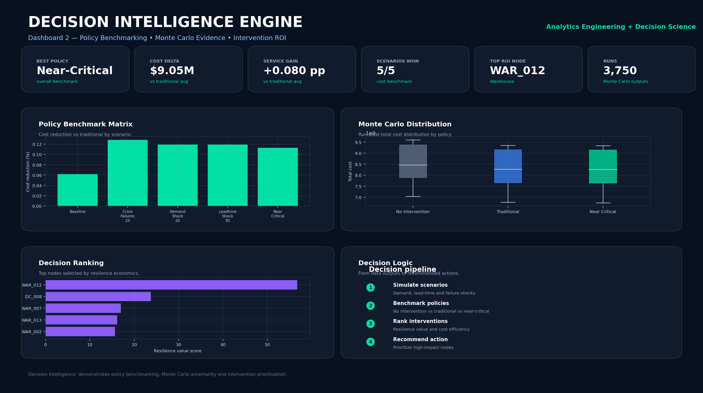
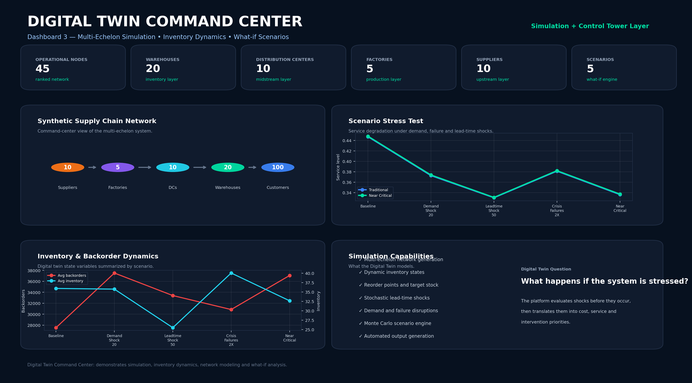
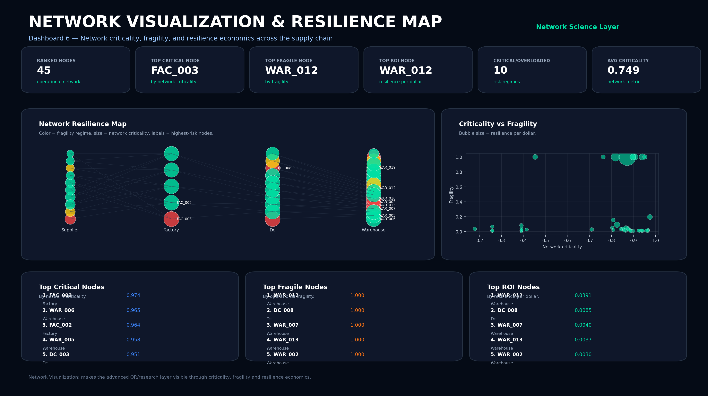
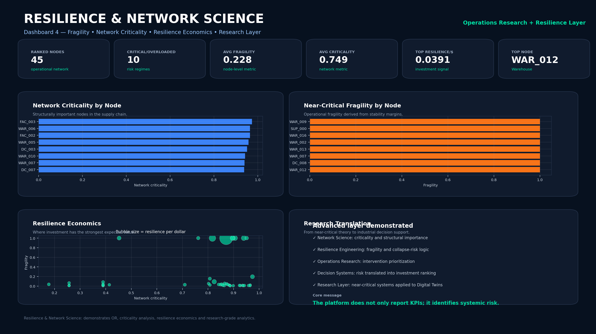

# Supply Chain Digital Twin & Decision Intelligence Platform

Industrial analytics platform integrating **Monte Carlo simulation**, **Digital Twin modeling**, **network science**, **intervention optimization**, **resilience analytics** and **executive decision support**.

This repository is designed as a complete portfolio-grade project demonstrating the progression from **Business Analytics** and **Executive Reporting** to **Analytics Engineering**, **Operations Research**, **Digital Twins**, **Network Science** and **Resilience Analytics**.

---

## Executive Summary

Modern supply chains operate under uncertainty: demand shocks, lead-time variability, supplier failures, capacity limits and cascading operational risk.

This project builds a modular **Supply Chain Digital Twin** that simulates multi-echelon supply-chain behavior, evaluates policies under uncertainty and recommends resilience interventions using simulation-driven decision intelligence.

The platform answers questions such as:

- Which nodes create the greatest operational risk?
- Which policy performs best under disruption scenarios?
- Where should resilience investment be allocated?
- How does service level change under demand, lead-time or failure shocks?
- Which nodes combine fragility, economic severity and network importance?

---

## System Architecture



The repository is organized as a modular analytics platform:

```text
Data / Network Generation
        ↓
Digital Twin Simulation
        ↓
Monte Carlo Scenario Engine
        ↓
Policy Benchmarking
        ↓
Network Criticality Analysis
        ↓
Intervention Optimization
        ↓
Executive Reporting & Dashboards
```

---

## Core Capabilities

| Layer | What it demonstrates | Repository modules |
|---|---|---|
| Business Analytics | KPIs, executive reporting, dashboard design | `src/reporting/`, `src/analytics/kpis.py` |
| Analytics Engineering | Modular pipelines, reproducible outputs, automated reports | `run_all.py`, `src/` |
| Simulation | Monte Carlo, uncertainty, scenario analysis | `src/simulation/monte_carlo.py`, `src/simulation/numba_core.py` |
| Digital Twin | Inventory dynamics, disruptions, what-if analysis | `src/simulation/digital_twin.py` |
| Network Science | Criticality, fragility, structural risk | `src/analytics/network_criticality.py`, `src/analytics/delta_metrics.py` |
| Decision Science | Policy comparison, intervention ranking | `src/policies/`, `src/optimization/intervention_engine.py` |
| Resilience Analytics | Near-critical risk logic and resilience economics | `src/analytics/`, `src/optimization/` |

---

## Dashboard Gallery

### Dashboard 5 — Supply Chain Control Tower

Operational command-center view for risk, service, cost and recommended policy.



---

### Dashboard 1 — Executive Analytics

KPI reporting, scenario analysis, policy comparison and executive decision support.



---

### Dashboard 2 — Decision Intelligence

Policy benchmarking, Monte Carlo evidence, intervention ranking and decision support.



---

### Dashboard 3 — Digital Twin Command Center

Multi-echelon simulation, inventory dynamics and what-if stress testing.



---

### Dashboard 6 — Network Visualization & Resilience Map

Network-level representation of criticality, fragility and resilience economics.



---

### Dashboard 4 — Resilience & Network Science

Network criticality, fragility, resilience per dollar and research-grade analytics.



---

## What This Project Demonstrates

### Business Analytics

- KPI development
- Executive reporting
- Dashboard design
- Supply-chain performance analysis
- Service-level benchmarking

### Data Analytics

- Scenario analysis
- Cost-benefit analysis
- Policy comparison
- Resilience metrics
- Operational risk assessment

### Analytics Engineering

- Modular Python project structure
- Automated simulation and reporting pipeline
- Reproducible analytics workflows
- Structured CSV, figure and dashboard outputs

### Simulation & Digital Twins

- Monte Carlo simulation
- Inventory dynamics
- Lead-time variability
- Backorders
- Demand and failure shocks
- What-if experimentation

### Operations Research & Decision Science

- Policy benchmarking
- Intervention prioritization
- Resilience economics
- Resource allocation logic
- Decision-support systems

### Network Science

- Network criticality analysis
- Fragility modeling
- Critical node identification
- Structural risk assessment

### Resilience Analytics

- Near-critical system evaluation
- Collapse-risk logic
- Resilience investment ranking
- Supply-chain risk analytics

---

## Repository Structure

```text
Supply-Chain-Digital-Twin/
│
├── run_all.py
├── smoke_test_numba.py
├── requirements.txt
├── README.md
├── publish_repo.bat
│
├── src/
│   ├── generator/
│   │   └── generate_network.py
│   ├── simulation/
│   │   ├── digital_twin.py
│   │   ├── monte_carlo.py
│   │   └── numba_core.py
│   ├── analytics/
│   │   ├── delta_metrics.py
│   │   ├── kpis.py
│   │   └── network_criticality.py
│   ├── policies/
│   │   ├── traditional_policy.py
│   │   └── near_critical_policy.py
│   ├── optimization/
│   │   └── intervention_engine.py
│   └── reporting/
│       ├── dashboard.py
│       ├── executive_report.py
│       └── plots.py
│
├── data/
├── results/
├── figures/
├── reports/
│
├── dashboards/
│   ├── png/
│   ├── pdf/
│   └── html/
│
├── docs/
│   ├── assets/
│   └── near_critical_research_lineage.md
│
└── github/
```

---

## How To Run

Install dependencies:

```bash
python -m pip install -r requirements.txt
```

Run fast test:

```bash
python run_all.py --fast
```

Run full experiment:

```bash
python run_all.py
```

Custom run:

```bash
python run_all.py --days 365 --runs 1000
```

---

## Main Outputs

The pipeline generates:

```text
data/
results/
figures/
reports/
```

Including:

- `nodes.csv`
- `nodes_enriched.csv`
- `policy_summary.csv`
- `policy_comparison.csv`
- `intervention_ranking.csv`
- `monte_carlo_results.csv`
- executive report
- dashboard HTML
- visualization figures

---

## Technical Stack

- Python
- Pandas
- NumPy
- Numba
- NetworkX
- Matplotlib
- Monte Carlo Simulation
- Digital Twin Modeling
- Operations Research
- Network Science

---

## Portfolio Positioning

This project is designed to support applications to roles such as:

- Data Analyst
- Business Analyst
- Supply Chain Analyst
- Operations Analyst
- Analytics Engineer
- BI Engineer
- Decision Scientist
- Data Scientist, Operations Research
- Supply Chain Data Scientist
- Digital Twin Analyst
- Resilience Analyst
- Risk Analytics Specialist

---

## Research Extension

The project includes an advanced resilience layer inspired by near-critical systems research.

The framework extends traditional supply-chain analytics by incorporating:

- Network criticality
- Fragility analysis
- Resilience economics
- Intervention prioritization
- Near-critical operating regimes

The goal is to bridge industrial decision support and resilience engineering within a reproducible Digital Twin environment.

---

## Research lineage: near-critical systems extension

This supply-chain digital twin includes a resilience layer derived from prior near-critical systems research. The original near-critical benchmark supplied the stability-margin logic, where a node is considered physically near critical when its expected supply-demand margin is small:

`delta = expected_supply - expected_demand`

The digital-twin extension translates that single-node idea into a networked supply-chain setting. Instead of using near-criticality only as a theoretical indicator, the platform uses it as a decision variable for preventive intervention thresholds.

### What came from the near-critical benchmark

- Stability-margin variable `delta`.
- Preventive threshold-control logic.
- Collapse-to-prevention cost ratio `K_fail / K_prevent`.
- Physical/economic boundary interpretation.
- Monte Carlo comparison against run-to-failure and static safety policies.

### What this digital twin adds

- Multi-echelon supply-chain structure: suppliers, factories, distribution centers, warehouses, and customers.
- Network-aware threshold policy.
- Node-level and network-level stockout/lost-demand evaluation.
- Delta-controlled demand scaling.
- Policy surfaces over physical criticality and economic severity.

The associated research package is maintained separately here:

[Near-Critical Network Digital Twin](https://github.com/net421/near-critical-network-digital-twin)

For a clearer explanation of what was reused and what was newly added, see [`docs/near_critical_research_lineage.md`](docs/near_critical_research_lineage.md).
